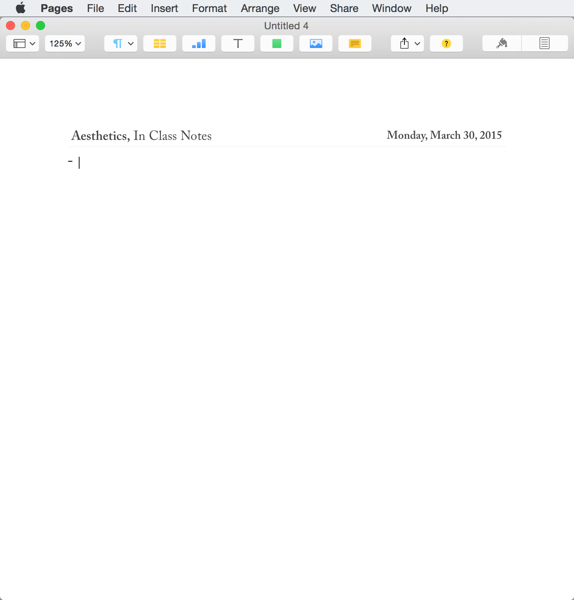

# Pages

So far the most important, and really only necessary, template I use is my own [Formal Notes](Formal Notes.template). This was developed after several years of puzzling with other templates and physical formats, always coming up short for the best and most attractive way to concisely write up notes.

**The primary typeface used in this template is [Adobe Caslon Pro](https://typekit.com/fonts/adobe-caslon-pro).** If you do not own this typeface, or any of its similar brothers (e.g. Garamond), try out another bold serif-face. One of my favorites, particularly on a retina display, is [Iowan Old Style](https://www.myfonts.com/fonts/bitstream/iowan-old-style/).

